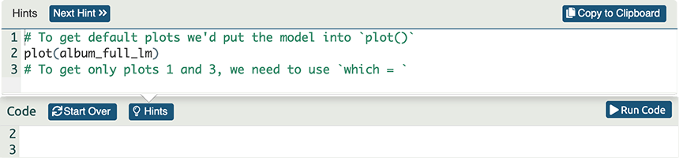

<html lang="en">

```{r setup, include=FALSE}
knitr::opts_chunk$set(
	echo = TRUE,
	message = FALSE,
	warning = FALSE
)

#necessary to render tutorial correctly
library(learnr) 
library(htmltools)
#tidyverse
library(dplyr)
library(ggplot2)
#non tidyverse
library(broom)
library(DT)
library(metafor)
library(knitr)

source("./www/discovr_helpers.R")


#Read dat files needed for the tutorial

pearce_2016 <- metahelpr::pearce_2016


tbl_font_size <- "12pt"

# create some global tibbles

pearce_es <- metafor::escalc(measure = "ZCOR",
                ri = r,
                ni = n,
                slab = author,
                var.names = c("zr", "v_zr"),
                data = pearce_2016) |> 
  as_tibble()

pearce_agg <- pearce_es |> 
  dplyr::group_by(author) |> 
  dplyr::summarize(
    zr = mean(zr, na.rm = T),
    v_zr = mean(v_zr, na.rm = T),
    n = mean(n, na.rm = T)
  )
```


```{r, eval = F, echo = F}
# Create bib file for R packages
here::here("inst/tutorials/meta_r/packages.bib") |>
  knitr::write_bib(c('here', 'tidyverse', 'dplyr', 'DT', 'readr', 'forcats', 'tibble', 'knitr', 'broom', 'metafor', 'metahelpr'), file = _)
```


# metahelpr: Meta-analysis using Pearson's *r*

## Overview

<div class="infobox">
  
  
  **Usage:** This tutorial is offered under a [Creative Commons Attribution-NonCommercial-NoDerivatives 4.0 International License](http://creativecommons.org/licenses/by-nc-nd/4.0/). Tl;dr: you can use this tutorial for teaching and non-profit activities but please don't meddle with it or claim it as your own work.
  
</div>

### `r cat_space(fill = blu)` Welcome to the `discovr` space pirate academy

Hi, welcome to **discovr** space pirate academy. Well done on embarking on this brave mission to planet `r rproj()`s, which is a bit like Mars, but a less red and more hostile environment. That's right, more hostile than a planet without water. Fear not though, the fact you are here means that you *can* master `r rproj()`, and before you know it you'll be as brilliant as our pirate leader Mae Jemstone (she's the badass with the gun). I am the space cat-det, and I will pop up to offer you tips along your journey.

On your way you will face many challenges, but follow Mae's system to keep yourself on track:

* `r bmu(height = 1.5)` This icon flags materials for *teleporters*. That's what we like to call the new cat-dets, you know, the ones who have just teleported into the academy. This material is the core knowledge that everyone arriving at space academy must learn and practice. For accessibility, these sections will also be labelled with [(1)]{.alt}.
* `r user_visor(height = 1.5)` Once you have been at space pirate academy for a while, you get your own funky visor. It has various modes. My favourite is the one that allows you to see everything as a large plate of tuna. More important, sections marked for cat-dets with visors goes beyond the core material but is still important and should be studied by all cat-dets. However, try not to be disheartened if you find it difficult. For accessibility, these sections will also be labelled with [(2)]{.alt}.
* `r user_astronaut(height = 1.5)` Those almost as brilliant as Mae (because no-one is quite as brilliant as her) get their own space suits so that they can go on space pirate adventures. They get to shout *RRRRRR* really loudly too. Actually, everyone here gets to should *RRRRRR* really loudly. Try it now. Go on. It feels good. Anyway, this material is the most advanced and you can consider it optional unless you are a postgraduate cat-det. For accessibility, these sections will also be labelled with [(3)]{.alt}.

It's not just me that's here to help though, you will meet other characters along the way:

* `r alien(height = 1.5)` aliens love dropping down onto the planet and probing humanoids. Unfortunately you'll find them probing you quite a lot with little coding challenges. Helps is at hand though. 
* `r robot(height = 1.5)` **bend-R** is our coding robot. She will help you to try out bits of `r rproj()` by writing the code for you before you encounter each coding challenge.
* `r bug(height = 1.5)` we also have our friendly alien bugs that will, erm, help you to avoid bugs in your code by highlighting common mistakes that even Mae Jemstone sometimes makes (but don't tell her I said that or my tuna supply will end). 

Also, use hints and solutions to guide you through the exercises (Figure 1).

<figure>

<figcaption>Figure 1: In a code exercise click the hints button to guide you through the exercise.</figcaption>
</figure> 
 

By for now and good luck - you'll be amazing!

### Workflow

* Before attempting this tutorial it's a good idea to work [this playlist of tutorials](https://youtube.com/playlist?list=PLEzw67WWDg83weG3idsgy4wuOIJAashA2&si=PiI-sDvqc1DkaWOq) on how to install, set up and work within `r rproj()` and `r rstudio()`.

* The tutorials are self-contained (you practice code in code boxes). However, so you get practice at working in `r rstudio()` I strongly recommend that you create an Quarto document within an `r rstudio()` project and practice everything you do in the tutorial in the Quarto document, make notes on things that confused you or that you want to remember, and save it. Within this Quarto document you will need to load the relevant packages and data. 


### Packages

This tutorial uses the following packages:

* `broom` [@R-broom]
* `here` [@R-here]
* `knitr` [@R-knitr]
* `metafor` [@R-metafor; @metafor2010]
* `metahelpr` [@R-metahelpr]

It also uses these `tidyverse` packages [@R-tidyverse; @tidyverse2019]: `dplyr` [@R-dplyr], `forcats` [@R-forcats], `ggplot2` [@wickhamGgplot2ElegantGraphics2016], and `readr` [@R-readr].

### Coding style

There are (broadly) two styles of coding:

1. **Explicit**: Using this style you declare the namespace (a.k.a. package name) when using a function: `package::function()`. For example, if I want to use the `mutate()` function from the package `dplyr`, I will type `dplyr::mutate()`. If you adopt an explicit style, you don't need to load packages at the start of your Quarto document (although see below for some exceptions).

2. **Concise**: Using this style you load all of the packages at the start of your Quarto document using `library(package_name)`, and then refer to functions without their namespace. For example, if I want to use the `mutate()` function from the package `dplyr`, I will use `library(dplyr)` in my first code chunk and thereafter refer to the function as `mutate()` when I use it.

Coding style is a personal choice. The [Google `r rproj()` style guide](https://google.github.io/styleguide/Rguide.html) and [tidyverse style guide](https://style.tidyverse.org/) recommend an explicit style, and I use it in teaching materials for two reasons (1) it helps you to remember which functions come from which packages, and (2) it prevents clashes resulting from using functions from different packages that have the same name. However, even with this style it makes sense to load `tidyverse` because the `dplyr` and `ggplot2` packages contain functions that are often used within other functions and in these cases explicit code is difficult to read. Also, no-one wants to write `ggplot2::` before every function from `ggplot2`.

You can use either style in this tutorial because all packages are pre-loaded. If working outside of the tutorial, load the `tidyverse` package (and any others if you're using a concise style) at the beginning of your Quarto document:

```{r eval = FALSE}
library(tidyverse)
```

### Data

To work *outside of this tutorial* you need to download the following data files:

* [pearce_2016.csv](https://milton-the-cat.rocks/data/csv/pearce_2016.csv)


Set up an `r rstudio()` project in the way that I recommend in this tutorial:


Then save the data files to the folder within your project called [data]{.alt}. Place this code in the first code chunk in your Quarto document:

```{r, eval=FALSE}
pearce_2016  <- here::here("data/pearce_2016.csv") |> readr::read_csv()
```

## `r user_visor()` Overview of the statistical model [(2)]{.alt} {#theory}

### Fixed and random effect models

Broadly speaking there are two flavours of the meta-analysis model, both of which are variations on the linear model. The first is the **fixed-effects model**, in which studies in the meta-analysis are assumed to be sampled from a population with a fixed effect size or one that can be predicted from a few predictors. In this model there is one source of 'error', which is sampling variation. Thinking about this in terms of a linear model we have

$$
\begin{aligned}
r_k &= \rho + \varepsilon_k \\
\varepsilon &\sim N(0, \sigma^2)
\end{aligned}
$$

In other words, the effect size (Pearson's *r*) in study *k* (denoted $r_k$) is 'predicted from' or 'made up of', the effect size (size of *r*) in the population, which we denote as $\rho$, plus some sampling error, denoted as $\varepsilon_k$ (the standard notation for linear models). The usual assumption applies that the model errors follow a normal distribution with a mean of 0 (i.e. on average the error is zero) and a variance denoted $\sigma^2$.

<div class="infobox">
  `r info()` **Information**

Although I refer to *r* in this section, for various reasons we estimate the model using a transformation of *r*, and then back-transform to interpret. See [the technical appendix](#appendix).
</div>


In tthehis model just described, the effect size in each study is assumed to have been generated from a single population with a single effect size and the only reason that effect sizes vary across studies is because of sampling variance. Spoiler alert, this conceptualization probably isn't realistic [@field_is_2005].

The alternative is the **random-effects model**, in which studies in the meta-analysis are assumed to be sampled from different populations with effect sizes that themselves vary. In this model there are two sources of 'error': (1) sampling variation (denoted as $\varepsilon_k$); (2) variation between the true (population) effect size from which studies are taken (denoted as $\zeta_k$). In terms of a linear model we have

$$
\begin{aligned}
r_k &= \rho_k + \varepsilon_k \\
\rho_k &= \theta + \zeta_k\\
\varepsilon &\sim N(0, \sigma^2) \\
\zeta &\sim N(0, \tau^2)
\end{aligned}
$$

The first line looks the same as the first line of the previous model except that the population effect size has acquired a subscript of $k$. This difference is important and reflects the fact that in the random-effects model effect sizes within studies are not assumed to reflect a single population effect size but are instead assumed to have come from a population with an effect size that is different to the populations from which other studies in the meta-analysis were sampled. So now, the effect size in study *k* is made up of the effect size in population *k* plus some sampling error. The second line tells us that the population effect size for study *k* ($\rho_k$) is made up of the true effect size ($\theta$) and sampling error at the population level $\zeta_k$. The population-level sampling error is assumed to be normally distributed with a mean of 0 (i.e. on average the error is zero) and a variance denoted $\tau^2$. The random effects model can, therefore be thought of in terms of effect sizes within studies being sampled from populations which themselves are sampled from a 'superpopulation' that has a fixed effect size that represents the 'true' effect size of interest.

This model can be thought of as a hierarchical model with two levels of the hierarchy.

#### The level 1 (participant level) model

Ignoring the distributions of errors to simplify things, at level 1 (the bottom level) we have the participant-level model in which effect sizes for study $k$ are predicted from the effect size in the corresponding population and some sampling variation (at the sample level).

$$
\begin{aligned}
r_k &= \rho_k + \varepsilon_k \\
\end{aligned}
$$

#### The level 2 (study level) model

At level 2 (the top level) we have the study-level model in which effect sizes for population $k$ is predicted from the true effect size and some sampling variation (at the population level).


$$
\begin{aligned}
\rho_k &= \theta + \zeta_k\\
\end{aligned}
$$

#### The composite model

Rather than spread the model across two lines, we can equivalently write it as:

$$
\begin{aligned}
r_k &= \theta + \zeta_k + \varepsilon_k \\
\varepsilon &\sim N(0, \sigma^2) \\
\zeta &\sim N(0, \tau^2)
\end{aligned}
$$


<div class="infobox">

The primary role of meta-analysis is, therefore, to use the data from many studies to estimate the population effect size. This estimate ($\hat{\theta}$) is assumed to reflect the true size of the effect of interest.
  
</div>

### Moderators of effect sizes

In the previous section, we saw that the effect size for a study can be expressed as a linear model. In that model, the effect size is predicted from the population effect size and some sources of sampling variation. In effect these models are 'intercept-only' models. That is, the effect size for a study is predicted from only the intercept (i.e. an estimate of the true effect size). However, familiarity with linear models tells us that the basic meta-analytic model could be extended to include any number of predictors. Each predictor would be added to the model, and would be assigned a parameter that is estimated form the data. These parameters quantify the size and direction of the relationship between each predictor and the size of effect. In general, if we denote predictors with $X$ and their parameters with $\beta$ (i.e. commonly-used symbols for linear models), we can use the data to estimate a model that includes predictors:

$$
\begin{aligned}
r_k &= \theta + \beta_1X_k + \beta_2X_k + \ldots + \beta_nX_k + \zeta_k + \varepsilon_k \\
\varepsilon &\sim N(0, \sigma^2) \\
\zeta &\sim N(0, \tau^2)
\end{aligned}
$$

Predictors/moderators can be continuous or categorical variables. When a moderator is made up of several categories then it's possible to use any of the standard coding schemes such as dummy coding, contrast coding and so on. In this tutorial we use an example of dummy coding.


<div class="infobox">

A secondary role of meta-analysis is to test predictions that the size of effect will be associated with specific predictors relating to things like sample and methodological characteristics.

</div>

### Multiple effect sizes within studies

It is the norm rather than the exception that studies contribute more than one effect size to a meta-analysis. For example, the outcome of interest might have been measured using different questionnaires yielding a different effect sizes for each measure. Clinical trials often use multiple control groups yielding different effect sizes for the intervention group compared to each of the controls. 

We can handle this situation by adding a middle level to our hierarchy which acknowledges that effect sizes are clustered within studies (or within some other variable of interest). 


#### The level 1 (participant level) model

At level 1 (the bottom level) we again have the participant level model in which effect sizes for study $k$ are predicted from the effect size in the corresponding population and some sampling variation (at the sample level). This main difference from the random-effects model is that there are now two subscripts to acknowledge that each effect size *j* is nested within study *k*. In other words, it acknowledges the presence of an extra level in the hierarchy.

$$
\begin{aligned}
r_{jk} &= \rho_{jk} + \varepsilon_{jk}
\end{aligned}
$$


#### The level 2 (within study level) model

At level 2 (the middle level) we have the within-study model which acknowledges that each population effect size associated with effect size *j* within study *k* ($\rho_{jk}$) is itself made up of the effect size for the associated population, $\kappa_k$ and some sampling error (denoted as $\zeta_{(2)jk}$ where the 2 tells us this is the error at level 2).

$$
\begin{aligned}
\rho_{jk} &= \kappa_k + \zeta_{(2)jk}\\
\end{aligned}
$$ 

Note that $\kappa_k$ does not have a *j* subscript because all of the *j* effect sizes within a study have the same population and, therefore, the same population effect size. However, different studies (and, remember, *k* denotes studies) have the same population and, therefore, the same population effect size so $\kappa$ varies across studies (*k*) but not across effect sizes within a study (*i*). 

The sampling error (denoted as $\zeta_{(2)jk}$) is assumed to be normally distributed with a mean of 0 and variance that we will denote as $\sigma^2_w$ with the *w* reminding us that this is *within*-study sampling error. The sampling error ($\zeta_{(3)k}$) reflects sampling variation across both effect sizes and studies and so has both *j* and *k* as subscripts.


#### The level 3 (between-study level) model

At level 3 (the top level) we have the study-level model in which effect sizes for population $k$ are predicted from the true effect size ($\theta$) and some sampling variation (at the population level).

$$
\begin{aligned}
\kappa_k &= \theta + \zeta_{(3)k}\\
\end{aligned}
$$

Note that $\theta$ has no subscripts because it is fixed (it is the true effect size and does not vary by study *k* or by effect size *j*). The sampling error (denoted as $\zeta_{(3)k}$) is assumed to be normally distributed with a mean of 0 and variance that we will denote as $\sigma^2_b$ with the *b* reminding us that this is *between*-study sampling error. The sampling error ($\zeta_{(3)k}$) reflects sampling variation across studies and so has a *k* subscript.

#### The composite model

Rather than spread the model across three lines, we can equivalently write it as follows, with the bottom three lines explicitly describing the distributions of the error terms.

$$
\begin{aligned}
r_{jk} &= \theta + \zeta_{(2)jk} + \zeta_{(3)k} + \varepsilon_{jk} \\
\varepsilon &\sim N(0, \sigma^2) \\
\zeta_{(2)} &\sim N(0, \sigma_w^2) \\
\zeta_{(3)} &\sim N(0, \sigma_b^2) \\
\end{aligned}
$$

In other words, effect size *j* within study *k* is made up of the true effect ($\theta$) plus sampling variation at the participant level ($\varepsilon_{jk}$), within each study ($\zeta_{(2)jk}$) and across studies ($\zeta_{(3)k}$)

#### Moderators

Within this extended framework we can add moderators of effect sizes in the same way as described earlier but the moderators can operate at the study level (all effect sizes within a study have the same value for a particular model) in which case they will have a *k* subscript only, or they can operate at the effect size level (effect sizes within a study can have different values of the same moderator in which case they have a *jk* subscript.) For example,

$$
\begin{aligned}
r_{jk} &= \theta + \beta_1X_k + \beta_2X_k + \ldots + \beta_nX_k + \zeta_{(2)jk} + \zeta_{(3)k} + \varepsilon_{jk} \\
\varepsilon &\sim N(0, \sigma^2) \\
\zeta_{(2)} &\sim N(0, \sigma_w^2) \\
\zeta_{(3)} &\sim N(0, \sigma_b^2) \\
\end{aligned}
$$


## `r bmu()` The study [(1)]{.alt} {#study}

Despite a general perception that violent or scary television creates anxiety in children, the research literature in 2016 was small and disparate. My Ph.D. student and I conducted a meta-analysis to quantify the impact of scary television and film on children’s internalizing emotions such as fear, anxiety, sadness, and sleep problems [@pearce_impact_2016]. As well as quantifying the overall effect we made various predictions about variables we expected to influence the size of association between scary TV exposure and anxiety. For this tutorial we will look at one of these moderators, which is how anxiety/internalizing was measured. Within the studies we located measures of the following were used

- Fear
- General anxiety
- Physiology
- Post traumatic stress disorder (PTSD)
- Sadness/Depression
- Sleep disorder

This tutorial works through some parts of the meta-analysis conducted by @pearce_impact_2016. Specifically we look at conducting meta-analysis using Pearson's *r* as the effect size.


## `r user_visor()` The raw data [(2)]{.alt}

Usually for a meta-analysis you would input the raw data into a CSV file. The data for this study are in Table 1. Note the following things and use the scroll bars to help you see parts of the data

- **Each row represents information for an effect size and each column codes that information**: for example, Becker-Blease et al. (2008) contributes 6 effect sizes to the meta-analysis. the first of these is the first row. The columns tell us things about that effect size such as that it was measured using a questionnaire (`methodology`), it measured fear (`outcome`), the tv exposure it relates to was news (`new_fiction`), the average age of participants in the study was 9.6 years (`mean_age_est`), the effect size itself was 0.15 (`r`) and was based on 1915 participants (`n`) and so on.
- Studies can contribute multiple effect sizes. As already mentioned, Becker-Blease et al. (2008) contributes 6 effect sizes. Looking at the variable `content` (you'll need to scroll across) you can see that the first two effect sizes relate to TV content depicting terrorism, the second two relate to kidnapping and the remaining two relate to TV content involving sniper.
- Each study is uniquely identified by variable (`author` and `study_id`)
- Each effect size (row) has a unique ID (`es_id`)
- When using *r* as an effect size measure you can typically extract this directly from the published article (this information is in `r`). You will need the sample size to calculate the variance of effect sizes (this is in `n`). 
- Sometimes studies don't include the information we need but report other information that can lead us to Pearson's *r*. For example, the paper might report a *t*-statistic or *p*-value for the comparison of mean anxiety in a group exposed to a scary news story compared to an unexposed group. Note this kind of information for any study that reports it. 

```{r, echo = F}
pearce_2016 |> 
  DT::datatable(caption = 'Table 1: Data from Pearce & Field (2016)',
                options = list(
                  autoWidth = TRUE,
                  scrollX = TRUE,
                  scrollY = "500px",
                  paginate = FALSE,
                  dom = 'tp',
                  columnDefs = list(
                    list(className = 'dt-center', targets = 2:ncol(pearce_2016)),
                    list(className = 'dt-left', targets = 1),
                    list(width = '250px', targets = c(1))
                    ),
                  initComplete = htmlwidgets::JS(
                    "function(settings, json) {",
                    paste0("$(this.api().table().container()).css({'font-size': '", tbl_font_size, "'});"),
                    "}")
                  )
                )
```


## `r user_visor()` Preparing the data [(2)]{.alt}

### `r user_visor()` Computing effect sizes and their variances [(2)]{.alt}

In general, when using the correlation coefficient for a meta-analysis you will have extracted that effect size directly from the study. However, the sampling distribution of Pearson's *r* is not normally distributed, so apply something called Fisher's *r*-to-*z* transformation [@fisher_probable_1921] and use these values (denoted $z_r$) as our effect size measure. We also need to calculate the sampling variance associated with each effect size, which is a function of the sample size. Details of these calculations are in the [the technical appendix](#appendix).

Luckily, provided we have values of *r* and the sample size on which it is based (*n*) we can use the `escalc()` function from `metafor` [@R-metafor; @metafor2010] to apply the transformation and calculate the sampling variance. The `escalc()` function uses the information in the data to compute $z_r$ and its variance and stores it in new columns/variables in your tibble. The raw data are stored in [pearce_2016]{.alt}.

#### `r robot()` Code example

The `escalc()` function takes the general form (including only the arguments relevant to us)

```{r, eval = F}
metafor::escalc(measure = "ZCOR",
                ri = column_containing_r_value,
                ni = column_containing_sample_size,
                ti = column_containing_t_statistic,
                pi = column_containing_p_value,
                slab = column_containing_author_labels,
                var.names = c("variable_name_for_effect_size", "variable_name_for_effect_size_variance"),
                data = name_of_tibble) |> 
  as_tibble()
```

- The argument `measure = "ZCOR"` specifies the effect size measure to calculate and ["ZCOR"]{.alt} stands for Fisher's *r*-to-*z* transformed correlation coefficient [@fisher_probable_1921]. Basically this will transform our values of *r* into $z_r$ and store them in a new column. See [the technical appendix](#appendix).
- For most studies we will estimate $z_r$ from the value of *r* extracted from the paper and we will estimate the sampling variance from the associated sample size. Two arguments allow you to specify the variables in the data that relate to this information.
    - `ri` = specify the variable containing the extracted correlation coefficients (in this case `r``)
    - `ni` = specify the variable containing the sample size for each correlation coefficient (in this case `n`)
- As mentioned above, sometimes studies don't include the information we need but we can get Pearson's *r* in a different way. For example, if the paper reports a *t*-statistic or *p*-value for the comparison of mean anxiety in a group exposed to a scary news story compared to an unexposed group we can estimate *r* based on these. There are arguments for obtaining $z_r$ in this way:
  - `ti` = (if you have one) specify a variable containing *t*-statistics that compare your target group to the control on the outcome of interest (we don't a variable like this in the data as we could get *r* directly form all studies)
  - `pi` = (if you have one) specify a variable containing a *p*-statistics for a comparison of a relevant group to an appropriate control on the outcome of interest (we don't have such a variable in these data). Be careful with this argument, see [www.metafor-project.org/doku.php/tips:assembling_data_smd](https://www.metafor-project.org/doku.php/tips:assembling_data_smd)
  - `slab` = specify the variable that contains the text labels for the studies (in this case `author`)
  - `var.names` = specify names for the variables that `escalc` creates. I'd suggest `zr`, `v_zr` for the effect size and its variance respectively.
  - `data` = specify the name of the tibble you want to use (in this case `pearce_2016`).

For these data the final code will look like this:

```{r, eval = F}
pearce_es <- metafor::escalc(measure = "ZCOR",
                ri = r,
                ni = n,
                slab = author,
                var.names = c("zr", "v_zr"),
                data = pearce_2016) |> 
  as_tibble()
```


Notice at the end I have piped the output into `as_tibble()` which converts the data to a tibble. I have stored this `tibbble` as  `pearce_es` (outside of this tutorial you could instead replace the original tibble by assigning the results to `pearce_2016`).

<div class="tip">
  `r cat_space()` **Tip**

  The `escalc()` function appends the effect sizes and their variances to your data, but doesn't export the augmented data as a tibble. We can coerce the output into a tibble by piping the results of `escalc()` into the `tibble::as_tibble()` function. For example,

```{r, eval = F, class.source = '.panel_alt'}
my_data_with_effect_sizes <- metafor::escalc(...) |> 
  as_tibble()
```
</div>

#### `r alien()` Alien coding challenge

Use the code above to create a tibble called `pearce_es` that adds Pearson's *r* and its variance to the `pearce_2016` tibble. Display the tibble to see what it looks like and check it has added the two new columns that you want.

```{r es_tib, exercise = TRUE, exercise.lines = 14}

```

```{r es_tib-solution}
pearce_es <- metafor::escalc(measure = "ZCOR",
                ri = r,
                ni = n,
                slab = author,
                var.names = c("zr", "v_zr"),
                data = pearce_2016) |> 
  as_tibble()
pearce_es # show the data
```


### `r user_visor()` Aggregating effect sizes (optional) [(2)]{.alt} {#agg}

You might have data where every study contributes only a single effect size. In which case [skip this section]{.alt}. However, that's not the case for the data in this example. We can fit a model to the data as is, but if we want to create forest plots (more on them shortly) we might need a version of the data where we have aggregated effect sizes within studies (or some other variable of interest).

To be clear [it is not a requirement to aggregate the data]{.alt} but it can be useful to have a version of the data that contains a single effect size per study

#### `r robot()` Code example

To aggregate effect sizes within a variable we can use the `group_by()` and `summarize()` functions from `dplyr`. For example, this code

```{r, eval = F}
pearce_agg <- pearce_es |> 
  dplyr::group_by(author) |> 
  dplyr::summarize(
    zr = mean(zr, na.rm = T),
    v_zr = mean(v_zr, na.rm = T),
    n = mean(n, na.rm = T)
  )
```

takes the data in `pearce_es` and then groups it by the variable `author` (which identifies the study) and creates the variables `zr`, `v_zr` and `n` which are the average of the original variables of the same name. In other words, if a study has three values of `zr` it will occupy three rows in the original tibble, but in this new tibble it will occupy 1 row and the value of `zr` will be the average of the three values of `zr`.

#### `r alien()` Alien coding challenge

To get a feel for this execute the code below and compare `pearce_es` with `pearce_agg`.

```{r ex_pearce_agg, exercise = TRUE, exercise.lines = 10}
pearce_agg <- pearce_es |> 
  dplyr::group_by(author) |> 
  dplyr::summarize(
    zr = mean(zr, na.rm = T),
    v_zr = mean(v_zr, na.rm = T),
    n = mean(n, na.rm = T)
  )
pearce_es # view the original data
pearce_agg # view the aggregated data
```

```{r ex_pearce_agg-solution}
pearce_agg <- pearce_es |> 
  dplyr::group_by(author) |> 
  dplyr::summarize(
    zr = mean(zr, na.rm = T),
    v_zr = mean(v_zr, na.rm = T),
    n = mean(n, na.rm = T)
  )
pearce_es # view the original data
pearce_agg # view the aggregated data
```

You can also aggregate by multiple variables. For example, maybe we'd like to look at the different types of outcome measures in which case we want to aggregate both within study but also within outcome measure. 

#### `r robot()` Code example

If we want to aggregate taking the information in `outcome` into account we can add this variable to the `group_by()` function. The following code will aggregate effect sizes within each study, separately if they have different values of `outcome`. Note the only difference in this code is that we have added `outcome` into `group_by()` before `author`.

```{r, eval = F}
pearce_anx_agg <- pearce_es |> 
  dplyr::group_by(outcome, author) |> 
  dplyr::summarize(
    zr = mean(zr, na.rm = T),
    v_zr = mean(v_zr, na.rm = T),
    n = mean(n, na.rm = T)
  )
```


#### `r alien()` Alien coding challenge

Execute the code below and compare `pearce_es` with `pearce_agg` and `pearce_anx_agg` .

```{r ex_pearce_anx_agg, exercise = TRUE, exercise.lines = 10}
pearce_anx_agg <- pearce_es |> 
  dplyr::group_by(outcome, author) |> 
  dplyr::summarize(
    zr = mean(zr, na.rm = T),
    v_zr = mean(v_zr, na.rm = T),
    n = mean(n, na.rm = T)
  )
pearce_es # view the original data
pearce_agg # view the data aggregated within study
pearce_anx_agg # view the data aggregated within each outcome within each study
```

```{r ex_pearce_anx_agg-solution}
pearce_anx_agg <- pearce_es |> 
  dplyr::group_by(outcome, author) |> 
  dplyr::summarize(
    zr = mean(zr, na.rm = T),
    v_zr = mean(v_zr, na.rm = T),
    n = mean(n, na.rm = T)
  )
pearce_es # view the original data
pearce_agg # view the data aggregated within study
pearce_anx_agg # view the data aggregated within each outcome within each study
```

## `r user_visor()` Fitting the random effects model [(2)]{.alt} {#re}

### `r user_visor()` One effect size per study [(2)]{.alt} {#rma}

When we have a single effect size per study (as we do in [pearce_agg]{.alt}), we can use the `rma()` function from `metafor` to fit a random effects model. [This isn't the analysis we did in the paper]{.alt} because our data has multiple effect sizes per study, but we'll cover that in the next section.

The `rma()` function has the following form

```{r, eval = F}
my_model <- rma(yi = effect_sizes,
                vi = effect_size_variances,
                mods = moderator_variables,
                data = a_tibble,
                subset = specify_a_subset_of_the_tibble)
```

There are actually many more arguments, but the ones above are the only ones we need. We will look at [moderators](#mods) later, where we'll cover the [mods]{.alt} and [subset]{.alt} arguments. For now we will fit a no frills model.

#### `r robot()` Code example

For a no frills model we could use this code

```{r, eval = F}
pearce_ma <- rma(yi = zr, vi = v_zr, data = pearce_agg)
pearce_ma
```

which specifies the column containing effect sizes as [zr]{.alt}, the column containing effect size variances as [v_zr]{.alt} and the tibble containing the data as [pearce_agg]{.alt}, which is the tibble containing our aggregated data. The second line of code displays the results.


#### `r alien()` Alien coding challenge

Use the codebox below to fit a random effects model to the aggregated data in [pearce_agg]{.alt}.

```{r ex_pearce_ma, exercise = TRUE, exercise.lines = 3}

```

```{r ex_pearce_ma-solution}
pearce_ma <- rma(yi = zr, vi = v_zr, data = pearce_agg)
pearce_ma
```


```{r echo = F}
pearce_ma <- rma(yi = zr, vi = v_zr, data = pearce_agg)
```


The output contains several statistics:

- An estimate of $\tau^2$: this tells us the estimate of the variability in population effect sizes (see the theory section). In this case $\hat{\tau}^2$ = `r metafor::fmtx(pearce_ma$tau2, 3)`.
- The $I^2$ statistic is the percentage of the variability in effect sizes attributable to heterogeneity and not sampling error. Broad cut-offs of 25%, 50%, and 75% have been tentatively proposed for low, moderate, and high levels of heterogeneity [@higgins_measuring_2003], but these should not be applied thoughtlessly and context matters.  In this case $I^2$ = `r metafor::fmtx(pearce_ma$I2, 2)`%.
- The $H^2$ statistic is, essentially, a transformed and less intuitive version of $I^2$. It varies from 1 (homogeneity) to infinity (extreme heteroscedasticity). Probably just interpret $I^2$ and forget about $H^2$
- The $Q$ statistic tests the null hypothesis that effect sizes across studies are equal. A significant test can, therefore, be used to reject this null in favour of believing that heterogeneity exists. A non-significant test implies that heterogeneity wasn't sufficiently large to be detected in the current sample. This test has notoriously low power, so non-significant results especially should be treated tentatively. In the current sample `r metahelpr::report_het(pearce_ma)`
- The main part of the output is the estimate of $\theta$ (using our earlier general notation), which in this case is our estimate of the population effect size $\hat{\theta} = \hat{z}_r$ (remembering that we converted our *r*s to $z_r$s before fitting the model). We are told the estimate itself, it's confidence interval and a significance test of the null that the effect size is zero. For these data, `r metahelpr::report_pars(pearce_ma)`. 

<div class="reportbox">
  `r pencil()` **Report it!**

  About $I^2$ = `r metafor::fmtx(pearce_ma$I2, 2)`% of variability in effect sizes was attributable to heterogeneity. This is a considerable amount. The observed heterogeneity was significantly different than zero, `r metahelpr::report_het(pearce_ma)`. Overall there was a relatively small association between exposure to scary TV and anxiety, `r metahelpr::report_pars(pearce_ma)`. If we assume that this sample is one of the 95% that generates a confidence interval that captures the population value then this association could be as small as `r metafor::fmtx(pearce_ma$ci.lb, 2)` and as large as `r metafor::fmtx(pearce_ma$ci.ub, 2)`. 
  
</div>


### `r user_visor()` Multiple effect sizes per study [(2)]{.alt} {#rmamv}

When we have multiple effect size per study (as we do in [pearce_es]{.alt}), we use the `rma.mv()` function from `metafor` to fit a random effects model. The function has the following form

```{r, eval = F}
my_model <- rma.mv(yi = effect_sizes,
                   V = effect_size_variances,
                   random = ~1|variable_identifying_study/variable_identifying_effect_size
                   mods = moderator_variables,
                   data = a_tibble,
                   subset = specify_a_subset_of_the_tibble,
                   method = "REML")
```

The function is similar to `rma()` except that the effect size variance argument is named `V` rather than `vi`. One important difference is that we have to specify the nesting of the effect sizes within studies using the `random` argument. Essentially you need a numeric variable in the data that identifies each 'cluster' within which effect sizes are nested. Usually the 'cluster' is the study or article, but it could be something else. You also need a variable that uniquely identifies each effect size. In the current data `author` identifies each study and `es_id` identifies each effect size.

#### `r alien()` Alien coding challenge

Execute the following code, which selects the variables in the data that identify the studies, the effect size id, and the effect size itself. We view just the first 20 rows of the data.

```{r view_id_vars, exercise = TRUE, exercise.lines = 8}
pearce_es |> 
  dplyr::select(author, es_id, zr) |> 
  head(20)
```

You can see that, for example, the study by Becker-Blease et al. (2008) contributed 6 effect sizes to the data. These are identified both by the variable `author` (which tells us that these 6 effect sizes are clustered within the same study), and the variable `es_id` (which uniquely identifies the particular effect size).

To specify this nested structure we would, therefore, use

```{r eval = F}
random = ~1|author/es_id
```

Within `rma.mv()` we can specify whether to estimate the model parameters using the default of restricted maximum likelihood estimation ([method = "ML"]{.alt}) or full maximum likelihood, which is necessary if you want to compare nested models [method = "ML"]{.alt}. As with `rma()` there are many more arguments that we won't cover in this tutorial.


#### `r robot()` Code example

For a no frills model when each study contributes more than one effect size we could use this code

```{r, eval = F}
pearce_mamv <- rma.mv(yi = zr, V = v_zr, random = ~1|author/es_id, data = pearce_es)
pearce_mamv
```

which specifies the column containing effect sizes as [zr]{.alt}, the column containing effect size variances as [v_zr]{.alt}, the structure of the nesting of effect sizes as [~1|author/es_id]{.alt} and the tibble containing the data as [pearce_es]{.alt}, which is the tibble containing our aggregated data. The second line of code displays the results.


#### `r alien()` Alien coding challenge

Use the codebox below to fit a random effects model to the aggregated data in [pearce_agg]{.alt}.

```{r ex_pearce_mamv, exercise = TRUE, exercise.lines = 3}

```

```{r ex_pearce_mamv-solution}
pearce_mamv <- rma.mv(yi = zr, V = v_zr, random = ~1|author/es_id, data = pearce_es)
pearce_mamv
```

```{r, echo = F}
pearce_mamv <- rma.mv(yi = zr, V = v_zr, random = ~1|author/es_id, data = pearce_es)
```


The output contains several statistics:

- An estimate of $\sigma_b^2$: this tells us the estimate of the variability in population effect sizes (see the theory section). In this case $\hat{\sigma}_b^2$ = `r metafor::fmtx(pearce_mamv$sigma2[1], 3)`.
- An estimate of $\sigma_w^2$: this tells us the estimate of the variability in effect sizes within studies (see the theory section). In this case $\hat{\sigma}_w^2$ = `r metafor::fmtx(pearce_mamv$sigma2[2], 3)`.
- The $Q$ statistic tests the null hypothesis that effect sizes across studies are equal. A significant test can, therefore, be used to reject this null in favour of believing that heterogeneity exists. A non-significant test implies that heterogeneity wasn't sufficiently large to be detected in the current sample. This test has notoriously low power, so non-significant results especially should be treated tentatively. In the current sample `r metahelpr::report_het(pearce_mamv)`
- The main part of the output is the estimate of $\theta$ (using our earlier general notation), which in this case is our estimate of the population effect size $\hat{\theta} = \hat{z}_r$ (remembering that we converted our *r*s to $z_r$s before fitting the model). We are told the estimate itself, it's confidence interval and a significance test of the null that the effect size is zero. For these data, `r metahelpr::report_pars(pearce_mamv)`. 

<div class="reportbox">
  `r pencil()` **Report it!**
  
  For the overall model ignoring predictors, the between study variability was $\hat{\sigma}_b^2$ = `r metafor::fmtx(pearce_mamv$sigma2[1], 3)` and the within study variability was $\hat{\sigma}_w^2$ = `r metafor::fmtx(pearce_mamv$sigma2[2], 3)`. The observed heterogeneity was significantly different than zero, `r metahelpr::report_het(pearce_mamv)`. Overall there was small association between exposure to scary TV and anxiety symptoms, `r metahelpr::report_pars(pearce_mamv)`. If we assume that this sample is one of the 95% that generates a confidence interval that captures the population value then this association could be as small as `r metafor::fmtx(pearce_mamv$ci.lb, 2)` and as large as `r metafor::fmtx(pearce_mamv$ci.ub, 2)`.
</div>


It also possible to fitthe model using robust estimates of the variances and covariances by placing the model into `metafor::robust()`. This function takes the form

```{r, eval = F}
metafor::robust(my_model, cluster = variable_identifying_study)
```

Basically, you place your model into the function and specify the variable that identifies the 'clusters' in the data (in the current context our clusters are the different studies included in the meta-analysis, which are identified by the variable `author`).

#### `r robot()` Code example

To get a robust version of the model we just created we would execute

```{r, eval = F}
metafor::robust(pearce_mamv, cluster = author)
```

#### `r alien()` Alien coding challenge

Use the codebox below to fit and view a robust version of the model [pearce_mamv]{.alt}, store this model as [pearce_rob]{.alt}.

```{r ex_pearce_rob-setup}
pearce_mamv <- rma.mv(yi = zr, V = v_zr, random = ~1|author/es_id, data = pearce_es)
```


```{r ex_pearce_rob, exercise = TRUE, exercise.lines = 3}

```

```{r ex_pearce_rob-solution}
pearce_rob <- metafor::robust(pearce_mamv, cluster = author)
pearce_rob
```

```{r, echo = F}
pearce_rob <- metafor::robust(pearce_mamv, cluster = author)
```

Compare the output to the non-robust model. The thing that changes is the standard error, which has a knock on effect for the associated significance tests and confidence interval, but for these data the standard error doesn't change and, therefore, neither does anything else:

- Non-robust results: `r metahelpr::report_pars(pearce_mamv)`
- Robust results: `r metahelpr::report_pars(pearce_rob)`

## `r user_visor()` Forest plots [(2)]{.alt} {#forest}

A forest plot is a plot of each effect size and its confidence interval (usually) stacked vertically. The box displaying the effect size is scaled to reflect the precision of the effect size. Larger boxes indicate studies with greater sample sizes (and hence greater precision). In a meta-analysis studies based on larger samples (i.e. those with the least sampling error) are given more weight than smaller (less precise) studies. Therefore, the size of the box tells you something about the weight of effect size within the meta-analysis.  

The `metafor` package contains a very flexible system for creating forest plots (and other plots). At the core of this system is the `forest()` function. With flexibility comes a world of pain for trying to explain it all. So, to avoid that pain we'll look only at some of the key features of the `forest()` function. If you want to do anything more complicated then see some of the excellent examples at [https://www.metafor-project.org/doku.php/plots](https://www.metafor-project.org/doku.php/plots).

The `forest()` function takes the following form (with only a fraction of the numerous arguments listed).

```{r eval = F}
forest(my_model,
       transf = transformation_applied_to_outcome
       slab = variable_identifying_unique studies,
       header = "Name for the list of studies",
       cex = numeric_value,
       cex.lab = numeric_value,
       xlab = "label for x-axis",
       xlim = c(lower_limit, upper_limit),
       at = seq(start, stop, step),
       shade = TRUE,
       mlab = metahelpr::forest_add_het(model = my_model))
```

Essentially you put your model created with `rma()` into `forest` and that's it unless you want to specify some options. Remember that we converted our correlations so our effect sizes are $z_r$. If we use the default options the forest plot will show the values of $z_r$, which is fine but might be confusing unless readers know you have applied this transformation. In most situations your plot will be clearer if you plot the untransformed values (i.e. the raw correlations). We can do this setting the [transf]{.alt} argument to [transf.ztor]{.alt}


So a basic forest plot for `pearce_ma` is created with `forest(pearce_ma, transf = transf.ztor)`. It's as simple as that. However, you will probably want to change some things. The best way to see what the options do is to change them and look at the effect.

#### `r alien()` Alien coding challenge

To see what the different arguments do, use the code box to work through the following steps to build up the code like above. At each step add the suggested argument in a new line (remember to put a comma between the arguments), [execute the code]{.alt} and see what effect it has on the plot. If you get stuck, the hints show the correct code for each step.

1. Plot a default plot with `forest(pearce_ma, transf = transf.ztor)`
2. By default the studies are listed as "Study 1", "Study 2" etc. Let's label them using the `author` variable from the data by adding the argument `slab = author`. The left hand column should now show the study names.
3. We can add a heading to the column with the study names by adding `header = "Study name"` (you can change the text in quotes to whatever you want your heading to be).
4. Everything looks a bit small. We can change this by scaling everything using `cex`. This is definitely an argument to play around with until everything looks how you want it. Try adding `cex = 0.6` but try other values to get a feel for what changing the value does.
5. The text below the *x*-axis (which says 'observed outcome') looks big. We can scale this separately using `cex.lab`. Try setting this to `cex.lab = 1`, but again try different values and note the effect.
6. The *x*-label of 'observed outcome' isn't informative, so we can set this using `xlab = "Association between scary TV and anxiety"` (again change the text in quotes to what you want it to be).
7. The gap between the left and right columns and the plot in the middle can be reduced or expanded by setting the limits of the *x*-axis. The effect size data range from -0.3 to 0.7, so we could set limits of say -0.7 and 1 to see if this reduces the white space. Add the argument `xlim = c(-0.7, 1)` to do this (and again try different values and observe the effect when you execute the code).
8. We can set the intervals on the *x*-axis using `at`. The effect size data range from -0.3 to 0.7, so an interval of 0.1 might be good. If we include `at = seq(-0.3, 0.7, 0.1)` this will create ticks between -0.3 to 0.7 at intervals of 0.1 (that is, -0.3, -0.2, -0.1, 0, 0.1, 0.2, 0.3, 0.4, 0.5, 0.6, and 0.7).
9. If we include `shade = TRUE` alternate lines of the plot will be shaded which can make it easier to see which data relates to which study.
10. Finally, we can add a label at the bottom of the plot with `mlab`. This tutorial comes with a helper function (`forest_add_het()`) that adds heterogeneity statistics from a model to a forest plot. To add the heterogeneity statistics for our model ([pearce_ma]{.alt}) we need to include `mlab = metahelpr::forest_add_het(model = pearce_ma)`.

```{r forest-setup}
pearce_ma <- rma(yi = zr, vi = v_zr, data = pearce_agg)
```

```{r forest, exercise = TRUE, exercise.lines = 15}
# step 1:
metafor::forest(pearce_ma,
                transf = transf.ztor)
```

```{r forest-hint-1}
# step 2:
metafor::forest(pearce_ma,
                transf = transf.ztor,
                slab = author)
```

```{r forest-hint-2}
# step 3:
metafor::forest(pearce_ma,
                transf = transf.ztor,
                slab = author,
                header = "Study name")
```

```{r forest-hint-3}
# step 4:
metafor::forest(pearce_ma,
                transf = transf.ztor,
                slab = author,
                header = "Study name",
                cex = 0.6)
```

```{r forest-hint-4}
# step 5:
metafor::forest(pearce_ma,
                transf = transf.ztor,
                slab = author,
                header = "Study name",
                cex = 0.6,
                cex.lab = 1)
```

```{r forest-hint-5}
# step 6:
metafor::forest(pearce_ma,
                transf = transf.ztor,
                slab = author,
                header = "Study name",
                cex = 0.6,
                cex.lab = 1, 
                xlab = "Association between scary media and anxiety symptoms")
```

```{r forest-hint-6}
# step 7:
metafor::forest(pearce_ma,
                transf = transf.ztor,
                slab = author,
                header = "Study name",
                cex = 0.6,
                cex.lab = 1, 
                xlab = "Association between scary media and anxiety symptoms",
                xlim = c(-0.7, 1))
```

```{r forest-hint-7}
# step 8:
metafor::forest(pearce_ma,
                transf = transf.ztor,
                slab = author,
                header = "Study name",
                cex = 0.6,
                cex.lab = 1, 
                xlab = "Association between scary media and anxiety symptoms",
                xlim = c(-0.7, 1),
                at = seq(-0.3, 0.7, 0.1))
```

```{r forest-hint-8}
# step 9:
metafor::forest(pearce_ma,
                transf = transf.ztor,
                slab = author,
                header = "Study name",
                cex = 0.6,
                cex.lab = 1, 
                xlab = "Association between scary media and anxiety symptoms",
                xlim = c(-0.7, 1),
                at = seq(-0.3, 0.7, 0.1),
                shade = TRUE)
```

```{r forest-hint-9}
# step 10:
metafor::forest(pearce_ma,
                transf = transf.ztor,
                slab = author,
                header = "Study name",
                cex = 0.6,
                cex.lab = 1, 
                xlab = "Association between scary media and anxiety symptoms",
                xlim = c(-0.7, 1),
                at = seq(-0.3, 0.7, 0.1),
                shade = TRUE,
                mlab = metahelpr::forest_add_het(model = pearce_ma))
```
   
   
<div class="tip">
  `r cat_space()` **Tip: Saving plots**

If you are working in quarto your forest plots will be printed into your output file (html, PDF or Word). However, it is often useful to save the plot as an image file. You can do this manually in `r rstudio()`, but ideally you'd use code to make the process reproducible. We can save images using a series of functions that work in the same way and differ only in the format of the image they save (the clue to the format is in the name of the function): `png()`, `bmp()`, `jpeg()`, `tiff()` and `pdf()`. All of these functions have the same usage (I'll use `png()` in the example code but this works with the other functions:

```{r, eval = F, class.source = '.panel_alt'}
png(filename = "filename_for_plot.png", res = 300, width = 2000, height = 3000, units = "px")
# ... code to produce my plot ...
dev.off()
```

So, you initiate the image device (in this case `png()`) and within it you specify:

- `filename`: The filename you want to use. Obviously the file extension should match the function. So for `png()` the file extension should be `.png`, for `pdf()` it should be `.pdf` and so on. If you are working within an RStudio project the file will be saved in the main project directory but you can save it in a subfolder using the dot syntax. For example, if you have a folder called `images` you could save your image there with `filename = "./images/filename_for_plot.png`. You can also use `here()` to help you navigate to the folder you want (`filename = here("images/filename_for_plot.png")`.
- `res`: This sets the [resolution](https://en.wikipedia.org/wiki/Image_resolution) of the image in pixels per inch (ppi). For anything that might be printed 300 PPI is a sensible value although you could go lower for images you only intend to go online.
- `width` and `height`: are the width and height of the saved image in pixels.
- `units`: are the units of measurement. By default this is pixels, but you can change it to ["cm"]{.alt} or ["in"]{.alt} for centimetres and inches. If you change the units then any values specified in `width` and `height` will be in those units. For example, in the code above if we set `units = "cm"` then we'd be asking to save an image that was 2000 cm wide by 3000 cm tall (i.e. enormous!). So, if you change the units, set the `width` and `height` accordingly.

Having initiated the device, you include the code for your plot which will be 'printed' to the device (in this case it will be 'printed' to a file that is a PNG). Having done that we switch the device off with `dev.off()`. 

Therefore, we could save the forest plot we have just created using this code (incidentally, this won't work from within a tutorial but try it out in a quarto document):

```{r, eval = F, class.source = '.panel_alt'}
png(filename = "my_forest_plot.png", res = 300, width = 2000, height = 3000, units = "px")
metafor::forest(pearce_ma,
                transf = transf.ztor,
                slab = author,
                header = "Study name",
                cex = 0.6,
                cex.lab = 1, 
                xlab = "Association between scary media and anxiety symptoms",
                xlim = c(-0.7, 1),
                at = seq(-0.3, 0.7, 0.1),
                shade = TRUE,
                mlab = metahelpr::forest_add_het(model = pearce_ma))
dev.off()
```
</div>
   
       
## `r user_visor()` Moderators (meta-regression) [(2)]{.alt} {#mods}

### `r user_visor()` The moderation model [(2)]{.alt} {#modmodel}

We saw in the [theory section](#theory) that you can add predictors to the model to see the extent to which effect sizes are predicted by characteristics associated with them. This is sometimes referred to as [meta-regression]{.alt} but I don't like this term because, although I can see why its used, it implies that a different model is being fitted when moderators are included to the model that estimates only the overall effect size (i.e. the intercept). In fact, the underlying model is the same all that changes is whether you include only the intercept (standard meta-analysis) or include predictors (moderator analysis/meta-regression). So, make me happy and don't refer to this as meta-regression.

In the current example there was a specific prediction that effects might vary according to how anxiety/internalising symptoms are. The variable `outcome` represents the type of symptoms measured as explained in the [study description](#study). As a brief reminder there were measures of:

- Fear
- Post traumatic stress disorder (PTSD)
- General anxiety
- Sadness/Depression
- Physiology
- Sleep disorder

There isn't an obvious reference category, but there is a statistical argument for making the reference category one of the categories for which we have the most effect sizes. It turns out that the vast majority of studies used a measure of fear (*k* = 68) which was more than twice as many studies as the next largest, which was PTSD (*k* = 32). So, statistically, it makes sense to compare all categories to fear (incidentally, this is *not* what we did in the paper but it's what I would have done in retrospect). Given we want to use a single category as a reference we can use standard dummy coding to fit the following model:

$$
\begin{aligned}
r_{jk} &= \theta + \beta_1(\text{PTSD vs. Fear})_k + \beta_2(\text{General vs. Fear})_k + \\
&\quad \beta_3(\text{Sadness vs. Fear})_k + \beta_4(\text{Physiology vs. Fear})_k + \\
&\quad \beta_5(\text{Sleep vs. Fear})_k + \zeta_{(2)jk} + \zeta_{(3)k} + \varepsilon_{jk} \\
\varepsilon &\sim N(0, \sigma^2) \\
\zeta_{(2)} &\sim N(0, \sigma_w^2) \\
\zeta_{(3)} &\sim N(0, \sigma_b^2)
\end{aligned}
$$

If we place `outcome` into the model then `r rproj()` will convert this variable to 5 dummy variables that compare each category to the first. Let's check which category is the first.

#### `r robot()` Code example

Use the code box to check the order of the factor levels of the variable `outcome`

#### `r alien()` Alien coding challenge

```{r fct_levels, exercise = TRUE, exercise.lines = 4}

```

```{r fct_levels-solution}
levels(pearce_es$outcome)
```


You should find that the groups are currently ordered: Fear, PTSD, General, Sadness/Depression, Physiological, Sleep disorder. In fact this is what we want: we want everything to be compared to when fear was the outcome measure and this is the first category

<div class="tip">
  `r cat_space()` **Tip**

  If you want to compare each category to a category that is not currently the first category, you can use `forcats::fct_relevel()` to move the reference category to be the first level/category of your factor. The default behaviour of this function is to move the specified category to be first. For example, let's imagine we wanted to compare each category to "Sadness/Depression" because this category represents internalizing but not specifically anxiety. We could re-order the categories of `outcome` to achieve this:


```{r, eval = F, class.source = '.panel_alt'}
pearce_es <- pearce_es |>
  dplyr::mutate(
    outcome = forcats::fct_relevel(outcome, "Sadness/Depression")
  )
```

This code uses `mutate()` to change the variable `outcome` so that it is a version of itself in which the specified factor level ("Sadness/Depression") becomes the first level. Be careful of typos when you specify the factor level!
</div>

To include a predictor we assign it to the model as a formula using the `mods` argument of the `rma()` and `rma.mv()` functions. If you are familiar with the `lm()` function, then it's your lucky day because we use the same syntax. That is, if you want to add a single moderator the general syntax is (replacing `moderator_1` and `moderator_2` with the names of your variables):

```{r, eval = F}
mods = ~moderator_1
```

For two moderators with no interaction:

```{r, eval = F}
mods = ~moderator_1 + moderator_2
```

For two moderators with the interaction between them

```{r, eval = F}
mods = ~moderator_1*moderator_2
```

or equivalently

```{r, eval = F}
mods = ~moderator_1 + moderator_2 + moderator_1:moderator_2
```

and so on. We want to add in the variable `outcome` so the `mods` argument will be

```{r, eval = F}
mods = ~outcome
```


#### `r robot()` Code example

To add `outcome` as a moderator to our model we would take the code we used to fit the model without the moderators:

```{r, eval = F}
pearce_mod <- rma.mv(yi = zr,
                     V = v_zr,
                     random = ~1|author/es_id, data = pearce_es)
```

and assign a formula indicating how the moderator should be included to the `mods` argument:

```{r, eval = F}
pearce_mod <- rma.mv(yi = zr,
                     V = v_zr,
                     mods = ~outcome,
                     random = ~1|author/es_id, data = pearce_es)
```

As before, we get a robust version of this model by passing it into `robust` and specifying the variable representing the clusters (in this case studies):

```{r, eval = F}
pearce_rob <- robust(pearce_mod, cluster = author)
```


#### `r alien()` Alien coding challenge

Use the code box to fit a robust model with moderators and view the results.

```{r mods, exercise = TRUE, exercise.lines = 10}

```

```{r mods-hint-1}
# fit the model with moderators
pearce_mod <- rma.mv(yi = zr,
                     V = v_zr,
                     mods = ~outcome,
                     random = ~1|author/es_id, data = pearce_es)
# Now get the robust model
```

```{r mods-hint-2}
# get the robust model
pearce_rob <- robust(pearce_mod, cluster = author)

# Now view the model
```

```{r mods-solution}
# put it all together
# fit the model with moderators
pearce_mod <- rma.mv(yi = zr,
                     V = v_zr,
                     mods = ~outcome,
                     random = ~1|author/es_id, data = pearce_es)
# get the robust model
pearce_rob <- robust(pearce_mod, cluster = author)
# view the model
pearce_rob
```


```{r, echo = F}
pearce_mod <- rma.mv(yi = zr,
                     V = v_zr,
                     mods = ~outcome,
                     random = ~1|author/es_id, data = pearce_es)
pearce_rob <- robust(pearce_mod, cluster = author)
```


<div class="reportbox">
  `r pencil()` **Report it!**

The classification of effect sizes was dummy coded such that each category of effect size was compared to ones where fear was the outcome measure. In the model including these dummy variables the between study variability was $\hat{\sigma}_b^2$ = `r metafor::fmtx(pearce_rob$sigma2[1], 3)` and the within study variability was $\hat{\sigma}_w^2$ = `r metafor::fmtx(pearce_rob$sigma2[2], 3)`. The observed heterogeneity was significantly different from zero, `r metahelpr::report_het(pearce_rob)`.

The overall moderation effect was not significant, `r metahelpr::report_mod(pearce_rob)`. The parameter estimates (Table 2) indicated that the type of anxiety measured did not yield significantly different effect sizes to when fear was the outcome. 
</div>

```{r, echo = F}
metahelpr::report_par_tbl(pearce_rob,
                          pred_labels = c("Intercept", "PTSD vs. fear", "General vs. fear", "Sadness/depression vs. fear", "Physiological vs. fear", "Sleep disorder vs. fear")) |> 
  knitr::kable(caption = "Table 2: Parameter estimates for the type of fear measured",
               col.names = c("Predictor", "$\\hat{\\beta}$", "95% CI%", "$t$", "$p$"), 
               escape = FALSE)
```


<div class="tip">
  `r cat_space()` **Tip**

 Table 2 takes advantage of `metahelpr::report_par_tbl()`, which is a helper function for reporting parameyter estimates ina  nicely formatted table. I used the following code:

```{r, eval = F, class.source = '.panel_alt'}
metahelpr::report_par_tbl(pearce_rob,
                          pred_labels = c("Intercept", "PTSD vs. fear", "General vs. fear", "Sadness/depression vs. fear", "Physiological vs. fear", "Sleep disorder vs. fear")) |> 
  knitr::kable(caption = "Table 2: Parameter estimates for the type of fear measured",
               col.names = c("Predictor", "$\\hat{\\beta}$", "95% CI%", "$t$", "$p$"), 
               escape = FALSE)
```

Note that:

- Within `metahelpr::report_par_tbl()` I specify the meta-analysis model that I want to report and also supply the row labels for each predictor.
- Within `knitr::kable()` I supply a caption and column labels. The column labels use LaTeX to include mathematical symbols. For this to render properly we need two things:
  - LaTeX syntax that usually uses a forward slash (e.g. `\hat{}` and `\beta`) we need to use a double slash
  - Within `kable()` we need to include `escape = FALSE`.

</div>

### `r user_visor()` Subgroup analysis [(2)]{.alt} {#subgroup}

The overall moderation effect was not significant, `r metahelpr::report_mod(pearce_rob)`. It is common when a moderation effect is significant for a categorical moderator to run individual meta-analysis within each category of the moderator. Given that significance depends on power it is arguably informative to do this anyway. In this case this would mean running six meta-analyses, one for each fear measure. We can do this using the `subgroup` argument of the `rma()` and `rma.mv()` functions. We use this argument by assigning a logical argument to it. For example, to fit a meta-analysis only using the effect sizes that measured fear, we would include:

```{r, eval = F}
subset = (outcome == "Fear")
```

The stuff in parenthesis is a logical argument that says 'include the effect size of the value of the variable `outcome` exactly matches the text string ["Fear"]{.alt}. You have to make sure that your text string *exactly* matches the label of the group.

#### `r robot()` Code example

To add fit a model only to effect sizes relating to detailed FOA coding methods we'd use

```{r, eval = F}
general_ma <- rma.mv(yi = zr,
                     V = v_zr,
                     subset = (outcome == "Fear"),
                     random = ~1|author/es_id, data = pearce_es)
```

#### `r alien()` Alien coding challenge

Use the code box to fit a robust model with moderators and view the results.

```{r general_ma, exercise = TRUE, exercise.lines = 5}

```

```{r general_ma-solution}
general_ma <- rma.mv(yi = zr,
                     V = v_zr,
                     subset = (outcome == "Fear"),
                     random = ~1|author/es_id, data = pearce_es)
general_ma
```

Obviously it's fairly tedious fitting separate models, which is why I have written a helper function (`metahelpr::get_mas()`) that fits models to individual categories and tabulates the results. It may or may not work because I'm not that good at writing functions. You're welcome. This function takes the general form 

```{r eval = F}
metahelpr::get_mas(tibble = name_of_your_tibble,
                   predictor = name_of_the_categorical_variable,
                   es = variable_containing_effect_sizes,
                   var_es = variable_containing_effect_size_variances,
                   es_id = effect_size_identifier, # optional
                   study_id = cluster_identifier, # optional
                   digits = decimal_places_to_use_in_table, # (default is 2)
                   p_digits = decimal_places_to_use_for_p_values, #default is 3
                   summary = TRUE or FALSE
)
```

Essentially, you put into the function the name of your tibble, the name of the variable you want the subgroup analysis for, and the names of the variables containing the effect sizes and their variances.

- If you specify variables for `es_id` and `study_id` then the function fits the models with `rma.mv()` otherwise `rma()` is used.
- By default a summary table is returned `summary = TRUE`, but if you'd rather have a tibble containing the data for each group, the models, and each models coefficients then use `summary = FALSE`. Changing this default is useful only if you want access to specific parts of the models.

<div class="tip">
  `r cat_space()` **Tip**

  There is also a function called `get_mod_mas()` which has the same arguments as `get_mas()` but also has a `moderator` argument where you can specify a single predictor variable.
</div>

#### `r alien()` Alien coding challenge

Execute the code below to produce a table of results for the subgroup analysis of the effect of the type of methodology used to code memories.

```{r subgroups, exercise = TRUE, exercise.lines = 10}
mod_tbl <- metahelpr::get_mas(tibble = pearce_es,
                   predictor = outcome,
                   es = zr,
                   var_es = v_zr,
                   es_id = es_id,
                   study_id = author)
mod_tbl
```

<div class="tip">
  `r cat_space()` **Tip**

  If working in `quarto`, pipe the output of `get_mas()` into `knitr::kable()` to get a nicely formatted table and you can add styling and captions in the usual way.

```{r, eval = F, class.source = '.panel_alt'}
knitr::kable(mod_tbl)
```

In quarto you can add column names within `kable()`. For example, the code below uses LaTeX syntax to label the columns with the appropriate mathematical notation (this will work in quarto but in this tutorial).

```{r, eval = F, class.source = '.panel_alt'}
knitr::kable(mod_tbl,
             col.names = c("Outcome", "$k$", "$\\sigma_b^2$", "$\\sigma_w^2$", "$Q$", "$df$", "$p_q$", "\\hat{\\theta}", "95% CI", "$z$", "$p_z$"),
             escape = FALSE)
```

</div>

You might sometimes want to specify a forest plot that is split by groups too. Again, I've got your back (well, assuming my dodgy functions work). This package also has a function called `metahelpr::forest_subgroups()`, which attempts to create a forest plot with effect sizes grouped by a categorical variable.

#### `r robot()` Code example

For the current data we'd use this code.

```{r eval = F}
metahelpr::forest_subgroups(tibble = pearce_anx_agg,
                 es = zr,
                 var_es = v_zr,
                 groups = outcome,
                 transf = transf.ztor,
                 slab = author,
                 header = "Study name",
                 cex = 0.6,
                 cex.lab = 1, 
                 xlab = "Association between scary media and anxiety symptoms",
                 xlim = c(-0.8, 1),
                 at = seq(-0.4, 0.7, 0.1),
                 shade = TRUE)
```

The first four arguments require you to specify the data (we're using the data that aggregates effect sizes by study and anxiety measure, so.`tibble = pearce_anx_agg`), the variable containing the effect sizes (`es = zr`), the variable containing the effect size variances (`var_es = v_zr`), the variable that you want to use to group effect sizes (`groups = outcome`), the variable you want to use to label the studies (`slab = author`), and we want to plot the raw correlation coefficients so we need to back-transform the $z_r$ values using `transf = transf.ztor`. All the other options allow you to feed values into the `forest()` function so see the section on [forest plots](#forest) for an explanation. Note i have tweaked `xlim` and `at` compared to the earlier plot.


#### `r alien()` Alien coding challenge

Run the code below and play about with the arguments from `header` to `shade` to style the plot. Note I've used the data in `pearce_anx_agg` so that each study contributes a maximum of one effect size to each memory coding group on the plot. For example, 	
Lengua et al. (2005) contributes 3 effect sizes to *Fear* and 2 to *PTSD* but in `pearce_anx_agg` these have been averaged so that we plot a single effect for each of those categories for Lengua et al. (2005).

```{r sub_forest-setup}
pearce_anx_agg <- pearce_es |> 
  dplyr::group_by(outcome, author) |> 
  dplyr::summarize(
    zr = mean(zr, na.rm = T),
    v_zr = mean(v_zr, na.rm = T),
    n = mean(n, na.rm = T)
  )
```

```{r sub_forest, exercise = TRUE, exercise.lines = 15}
metahelpr::forest_subgroups(tibble = pearce_anx_agg,
                 es = zr,
                 var_es = v_zr,
                 groups = outcome,
                 transf = transf.ztor,
                 slab = author,
                 header = "Study name",
                 cex = 0.6,
                 cex.lab = 1, 
                 xlab = "Association between scary media and anxiety symptoms",
                 xlim = c(-0.8, 1),
                 at = seq(-0.4, 0.7, 0.1),
                 shade = TRUE)
```


In the code box below change produce the same plot but for the data in `pearce_es` (where effect sizes have not been aggregated) and see the difference.

```{r sub_forest2, exercise = TRUE, exercise.lines = 15}

```

```{r sub_forest2-solution}
metahelpr::forest_subgroups(tibble = pearce_es,
                 es = zr,
                 var_es = v_zr,
                 groups = outcome,
                 transf = transf.ztor,
                 slab = author,
                 header = "Study name",
                 cex = 0.6,
                 cex.lab = 1, 
                 xlab = "Association between scary media and anxiety symptoms",
                 xlim = c(-0.8, 1),
                 at = seq(-0.4, 0.7, 0.1),
                 shade = TRUE)
```


## `r user_visor()` Writing up [(2)]{.alt}

This package contains some functions that, when working in quarto or Rmarkdown will help you to automatically extract and report certain results:

-   `report_het()`: collates information from heterogeneity tests and outputs text that summarizes the results in a format that will render nicely in quarto. Execute `?report_het` for help.
-   `report_mod`: outputs text that reports (and renders nicely in quarto/Rmarkdown) the omnibus statistical tests from a moderation model. Execute `?report_mod` for help.
-   `report_par_tbl`: outputs a tibble of the table of coefficients of a meta-analyses object (`rma` or `rma.mv`) created using the `metafor` package. This function will mostly be useful for models containing predictors of effect sizes (so-called meta-regression). Execute `?report_par_tbl` for help.
-   `report_pars`: outputs text that reports (and renders nicely in quarto/Rmarkdown) the individual effects from a meta-analysis model. Execute `?report_pars` for help.


## `r user_astronaut()` Statistical appendix [(3)]{.alt} {#appendix}

### The sampling distribution of *r*

One problem with Pearson's *r* is that its sampling distribution is not normally distributed. Fortunately, we can transform *r* so that its sampling distribution is normal [@fisher_probable_1921]:
  
$$
z_r = \frac{1}{2} \log_e\left(\frac{1+r}{1-r}\right)
$$

The resulting $z_r$ has a variance ($\sigma^2_{z_r}$) and standard error ($SE_{z_r}$) that are a function of the sample size on which *r* is based:

$$
\begin{aligned}
SE_{z_r} & = \frac{1}{\sqrt{(N-3)}} \\
\sigma^2_{z_r} &= \frac{1}{N-3}
\end{aligned}
$$

So, although I talk about *r* and $\rho$ in the [theory section](#theory), in practice we estimate the model using the *z*-transformed *r* and then back-transform the results using

$$
\begin{aligned}
r &= \frac{e^{2z_r} - 1}{e^{2z_r} + 1}
\end{aligned}
$$

For more information on the sampling properties of *r* see one of my textbooks [@field_dsr2_2025; @field_ds6_2024; @field_adventure_2022] or someone else's textbook, but preferably mine.


## Resources {data-progressive=FALSE}

### The `metafor` package

- There's loads of great material on the `metafor` [project website](https://www.metafor-project.org/)
- This section is really good on [plots and Figures](https://www.metafor-project.org/doku.php/plots) and in particular useful for doing more sophisticated forest plots
- This is the [package website](https://wviechtb.github.io/metafor/), which contains all of the help files in a searchable and nice format! 

### Statistics

* This is a great free online book on [doing meta-analysis using R](https://bookdown.org/MathiasHarrer/Doing_Meta_Analysis_in_R/).
* There are free lectures and screencasts on my [YouTube channel](https://www.youtube.com/user/ProfAndyField/).
* There are free statistical resources on my websites [www.discoveringstatistics.com](http://www.discoveringstatistics.com) and [milton-the-cat.rocks](http://milton-the-cat.rocks).

### `r rproj()`

* [R for data science](http://r4ds.had.co.nz/index.html) by @wickhamDataScience2017 is an open-access book by the creator of the tidyverse (Hadley Wickham). It covers the *tidyverse* and data management.
* [`r rstudio()` cheat sheets](https://www.rstudio.com/resources/cheatsheets/).
* [`r rstudio()` list of online resources](https://www.rstudio.com/online-learning/).

### Acknowledgement

I'm extremely grateful to [Allison Horst](https://www.allisonhorst.com/) for her very informative blog post on [styling learnr tutorials with CSS](https://education.rstudio.com/blog/2020/05/learnr-for-remote/) and also for sending me a CSS template file and allowing me to adapt it. Without Allison, these tutorials would look a lot worse (but she can't be blamed for my colour scheme).

## References


